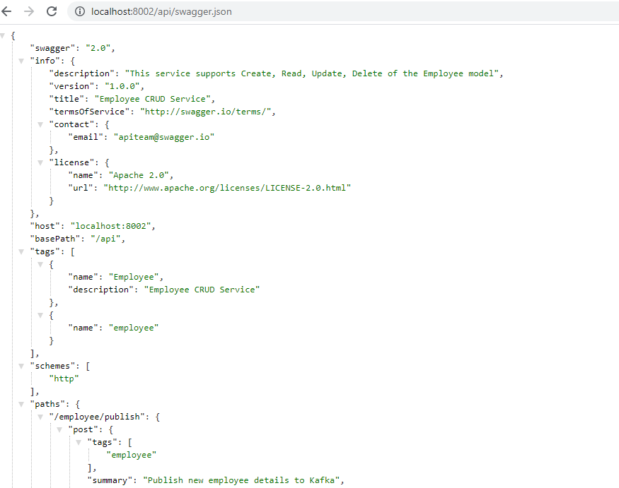
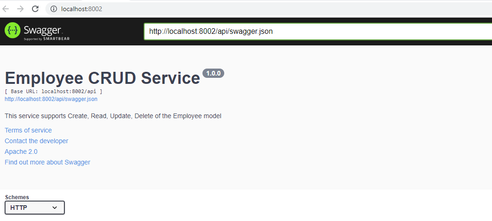
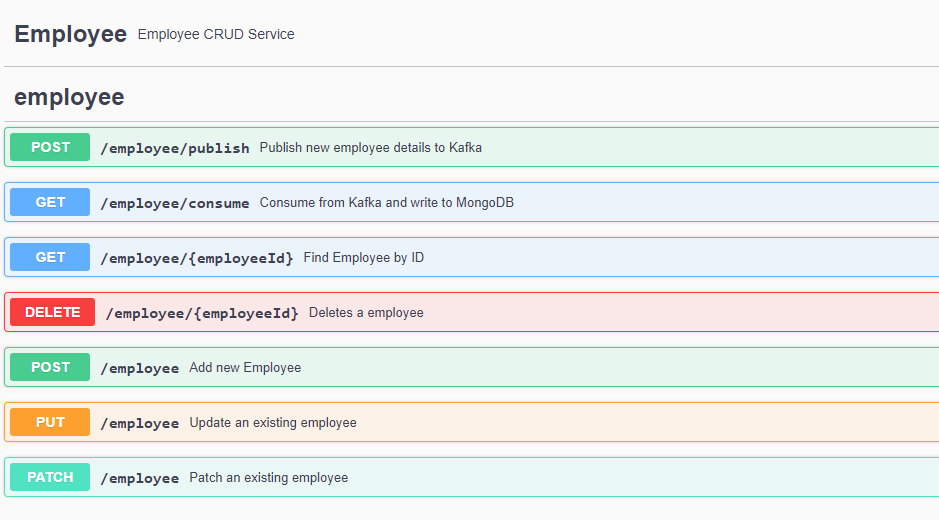

# Employee Service API(with Swagger)

This service enables CRUD operation for Employee. 

## Overview
This project runs on Jetty Server and uses MongoDB and Apache Kafka.

### To run (with Maven)
To run the server, run this task:

```
mvn package -Dlog4j.configuration=file:./conf/log4j.properties jetty:run
```

This will start Jetty embedded on port 8002.

### Swagger

Once started, you can navigate to http://localhost:8002/api/swagger.json to view the Swagger Resource Listing.
This tells you that the server is up and ready to demonstrate Swagger.



### Swagger UI
The Swagger UI is available at http://localhost:8002





More screenshots in `docs/screenshots` folder.

